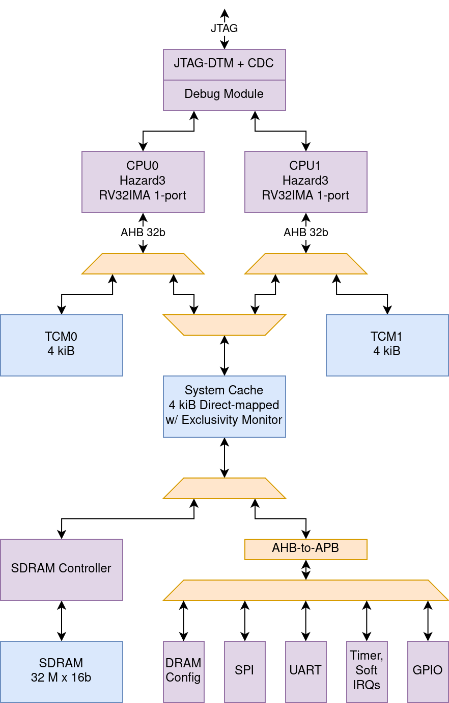

ChristmasSoc
------------

A dual-core SoC with JTAG, global atomics and SDRAM, based on my [Hazard3](https://github.com/Wren6991/Hazard3/) processor.

I want to build a SoC over Christmas. I am armed with this napkin sketch and not afraid to use it:

*Any resemblance of bus architecture to Christmas trees real or fictional is a coincidence*
